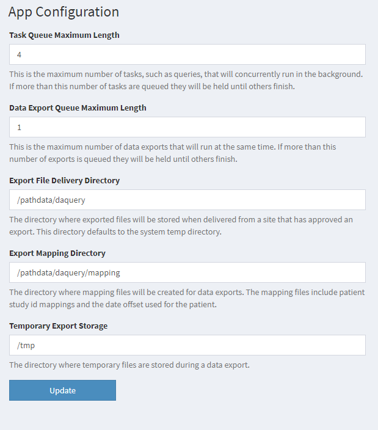

## Application Settings

To access the application level settings:

 * Log in as a user with admin privileges
 * Navigate to the Application Settings page by clicking App Configuration menu pick under the application menu in the upper right corner of the site.

Example values are shown here:

