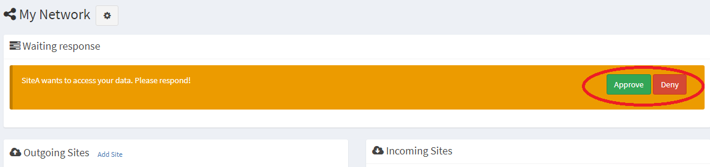

## Accept or reject a site connection

When another site wants to connect to your site to query or request data exports the registered site administrator will receive an email notification.  To approve or deny the request log into your Daquery application with an administrator account, click "Networks" on the left side menu, then click "Edit Network" for the network where the request was made.

At the top of the network edit screen you will see a notice that the site would like to connect.  Click Approve or Deny to accept or reject the request.

After approving a site connection edit the roles of users from the site to grant them aggregate query or date export rights.  See the [remote users roles](remote-user-roles.html) page for more information.