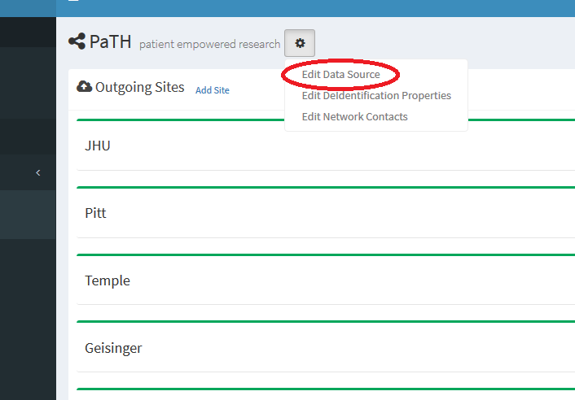

---
# You don't need to edit this file, it's empty on purpose.
# Edit theme's home layout instead if you wanna make some changes
# See: https://jekyllrb.com/docs/themes/#overriding-theme-defaults
layout: page
---

## Changing A Data Source

To join the PaTH network:
 * Log into the application with an account that has administrative rights.
 * Click the "Networks" menu pick in the left hand menu.
 * Click the "Edit Network" link on the network that you want to change the data source on.

 * On the resulting Network screen click the "gear" properties icon, and choose the "Edit Data Source" menu pick.

 * On the next screen edit the data source as desired and click "Test" to test the connection then "Change" to save the changes.
