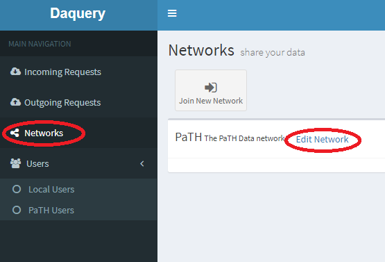
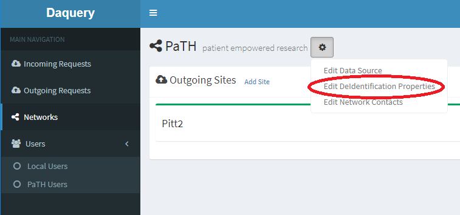
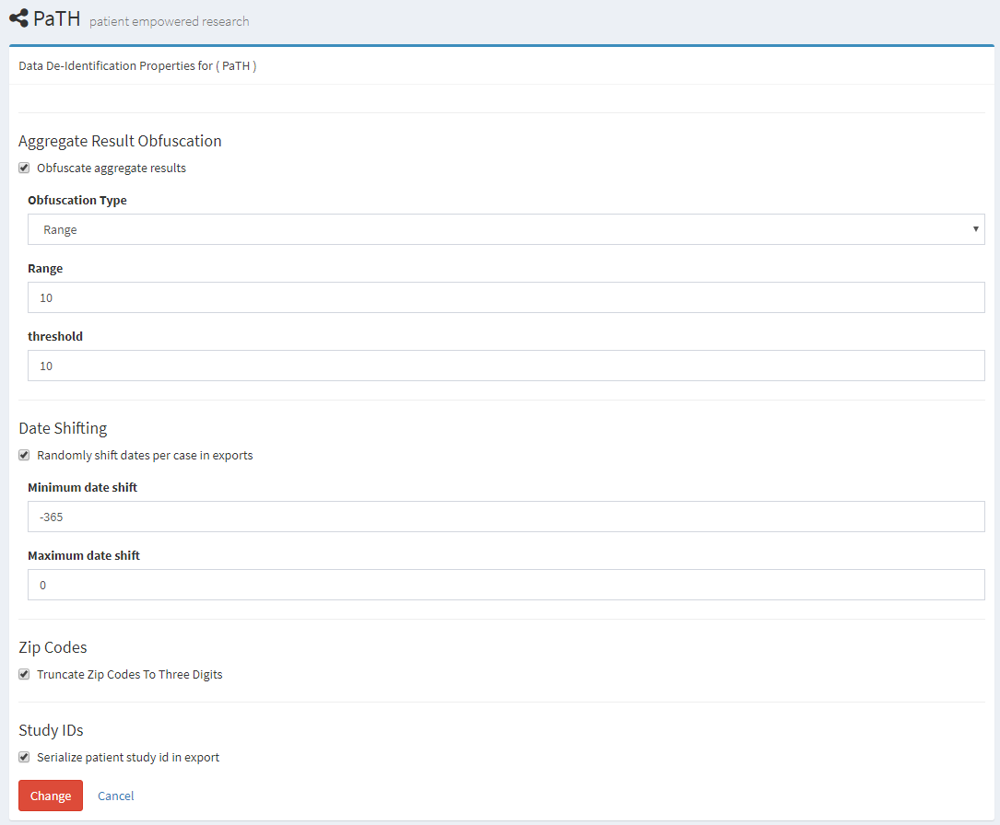

---
# You don't need to edit this file, it's empty on purpose.
# Edit theme's home layout instead if you wanna make some changes
# See: https://jekyllrb.com/docs/themes/#overriding-theme-defaults
layout: page
---

## Editing a networks DeId properties

To edit a network's DeId properties:
 * Log into the application with an account that has administrative rights.
 * Click the "Networks" menu pick in the left hand menu.
 * Click the "Edit Network" button next to the link of the network who's properties you want to edit.
 * From the properties/"gear" dropdown menu next to the network name, chose Edit DeIdentification Properties

The properties can be changed on the resulting screen.

