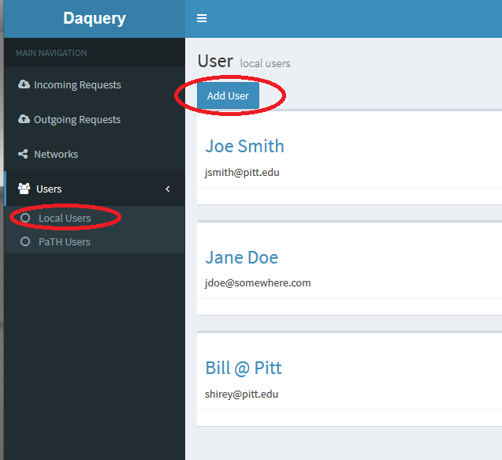
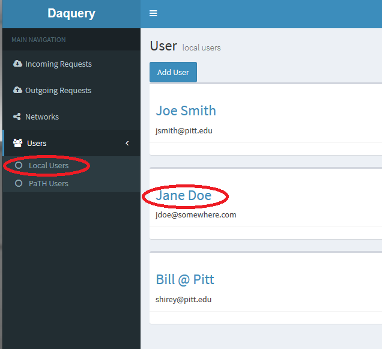
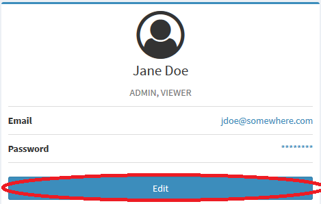

## Daquery Data Tool: Adding and Editing User Accounts

To add a or edit user accounts you must be logged into Daquery with an account that has admin rights.

### Add a user account
____________________________________________________________________
* To add a user account click the Local Users sub-menu in the left side menu, then click the Add User button.

* Fill in the email address, initial password and name of the user in the Add User dialog, then click the Submit button.
* You must separately communicate the login information to the user.  At first login the user will be asked to change their password.
* To edit the user's roles follow the Edit User instructions here:

### Edit a user account
* To edit a user account click the Local Users sub-menu in the left site menu, then click on the name of the user who you want to edit.

* Click the Edit button on the user information dialog.

* Edit the user information on the User Edit dialog and click the submit button.

