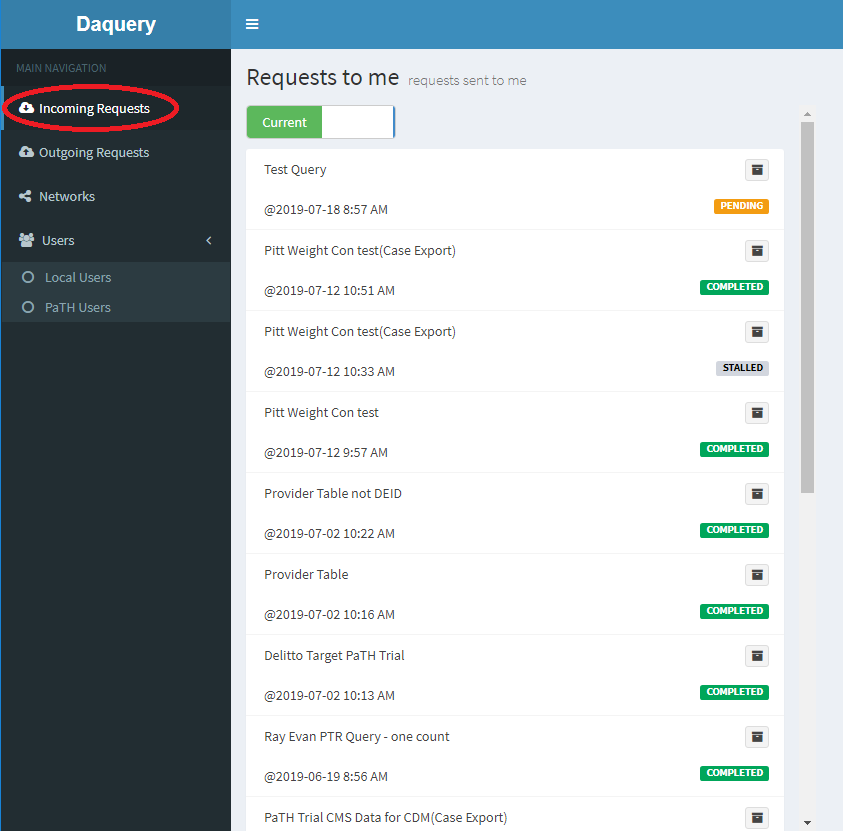

# Incoming Queries

Data stewards can approve queries by navigating to the Incoming Requests page, available on the left menu.  An email will be sent to users registered to recieve query notifications when a new request is made.  You can manage user notifications by modifying [Email Contacts](notification-contacts.html).

Queries are listed with their status on this page.  More details of the query can be show by clicking on the summary line for any query.

Any query listed with a yellow "PENDING" label await approval by a site data steward. A data steward can approve or deny a query by clicking the summary of the query to display the details and clicking the "Approve" or "Deny" buttons.

