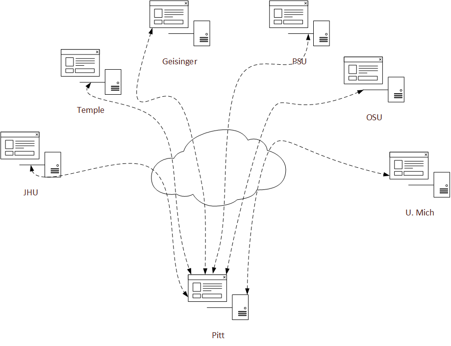

Daquery is a distributed query tool specifically designed for use by the PCRF PaTH network. The Daquery design allows for any node to run queries on any other node, if connected and granted permission.  The PaTH Network implementation of a Daquery network only allows the central, University of Pittsburgh, node to query and retceive data exported from other sites.

Basic user and administration tasks are documented in the [Usage Manual](use-main.html).

