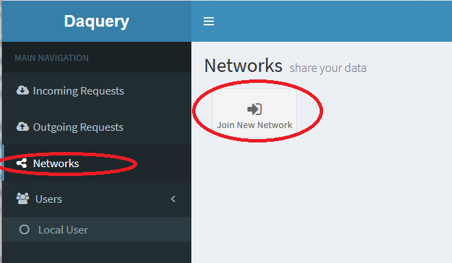
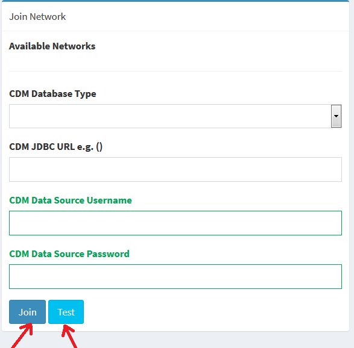

---
# You don't need to edit this file, it's empty on purpose.
# Edit theme's home layout instead if you wanna make some changes
# See: https://jekyllrb.com/docs/themes/#overriding-theme-defaults
layout: page
---

## Joining A Network

To join the PaTH network:
 * Log into the application with an account that has administrative rights.
 * Click the "Networks" menu pick in the left hand menu.
 * Click the "Join New Network" button.

On the next screen provide the database connection information to connect to your **production CDM 3.1** database/schema.  Make sure you hit the "Test" button to test the connection before you click the "Join" button.

Once you are a member or the Daquery PaTH network, notify the Pitt admin and you'll recieve a request to connect sites with Pitt.  More information on accepting site a connection request is [here](approve-site-connection.html).  After connected to a site you'll need to grant permission to the remote connected site's uses to query and export data.  More information on that can be found [here](remote-user-roles.html).