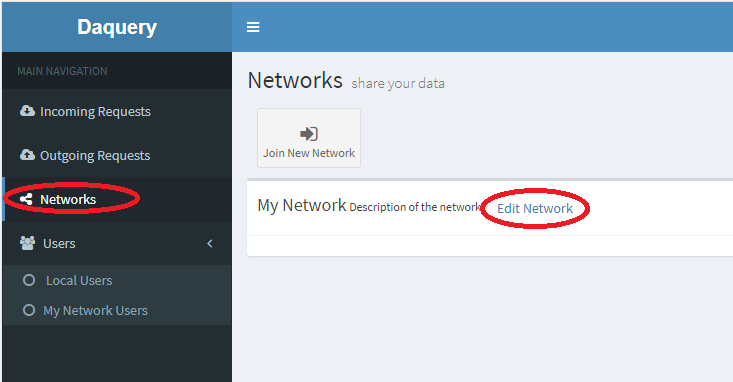
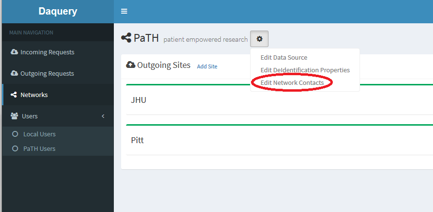
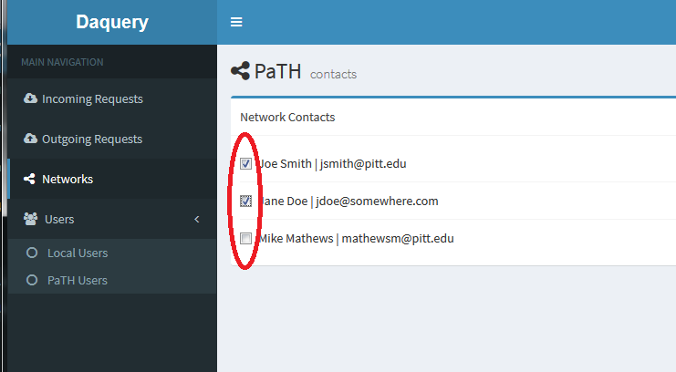
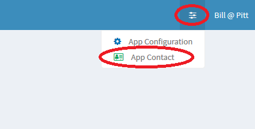
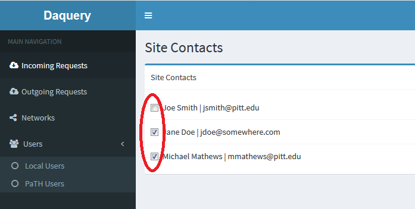

## Daquery Data Tool: Daquery Email Contacts

Daquery sends email notifications when certain events occur.  There are two types of events that contacts can be configured to receive,  Network Notifications and System Notifications.

### Network Notifications
Each joined network can have a set of contacts which will receive notifications on Request events such as when data is requested from a site.

#### Editing Network Contacts
-------------------------------------------------------------------
* Log into Daquery with a user account that has admin rights.

* Make sure any users who you want to add as contacts are local users.  See the [edit user page](edit-user.html) for more information on adding users.

* Choose the network that you want to edit by navigating to the Networks page and clicking the "Edit Network" link for the network that you want to change the contacts for.

* Click the "gear" settings icon for the network and choose "Edit Network Contacts"

* Choose the contacts who should receive emails related to the network.

## System Notifications
Daquery send system level notifications to specified admins on certain events such as when a site has been requested to receive requests from another site.

#### Editing System Contacts
-------------------------------------------------------------------
* Log into Daquery with a user account that has admin rights.

* Make sure any users who you want to add as contacts are added as local users with **_admin rights_**. Only users with admin rights are permitted to be system contact.  See the [edit user page](edit-user.html) for more information on adding or editing users.

* Open the system contact page by clicking the system properties menu in the upper right corner of the application and choosing the "App Contact" menu item.

* Select the users who will receive system notification emails.

