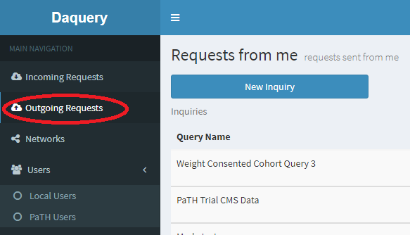

## Running a Query

To query any node a SQL query can be submitted via the the Outgoing Requests page, available on the left menu.

Daquery checks all SQL queries against the current data model (CDM 4.1 with PaTH extensions) and warns the user of any unknown fields being returned as potential for returning PHI.  Users constructing queries can add custom "DeId Tags" to a SQL query in the returned attributes (select clause) fields to identify any PHI to mask it in returned queries. More information on DeId tags can be found on the [DeId tag help page](deid-tags.html)  Because of the query analysis done prior to submitting the query with no access to the database **wildcard selects are not allowed** (e.g. select * from ...) in Daquery.

Any numeric or text field flagged as an identified field will be replaced with serialized values across all output for a singe data export (serialized values are not consistant across exports).  All dates are replaced by a shifted date where the shift is random by patient by export (every patient will have a different randomly generated shift for all dates for a single export). The DeId properties for a given network can be edited via the network's [DeId properties page](edit-deid-props.html). A log file is created on the site Daquery server that tracks id mappings and date shift values by patient.  The location of this log file can be configured with with "Export Mapping Directory" field on the [application settings page](app-settings.html).

Any query that returns only a single aggregate value, e.g. select count(attribute) . . ., will be automatically executed at remote sites. For any single count of patients via the PATID field, the option to download all of the data for those patients included in the count will is available from a "Request Data" button next to the result. These exports from a patient count, called Case Exports, includes all deidentified data from all fields in the PaTH extended CDM 4.1 data model. These Case Exports need to be approved (see Responding to Query Requests section above).

For all other queries returning anything other than a single aggregate value a request of each site will be made and a data steward will need to approve the query before it is executed and returned to the originating site.

For queries other than those returning single aggregate values the query will need to be approved before it is executed at a site by a site data steward, this includes Case Exports from patient aggregate queries.  Unless configured not to, all data returned to a querying site will be deidentified.
