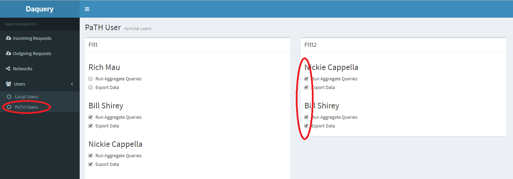

## Editing roles for remote users

To edit the roles of users from an incoming site to grant aggregate query or data export rights:
 - Log into Daquery with an administrator account
 - Click the user menu on the left corresponding to the network where you want to edit remote roles.
 - Edit the roles of the users on the remote user edit page on the right.

